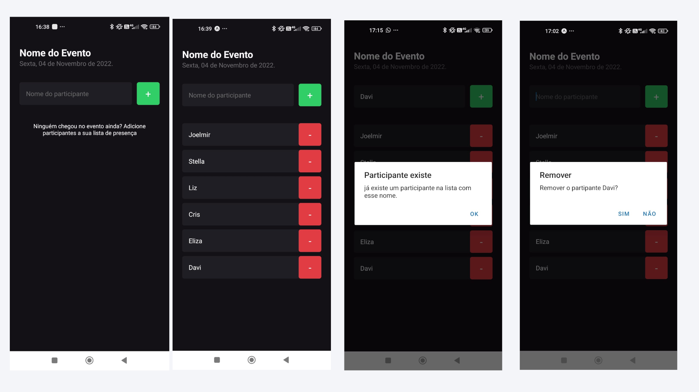

# ImHere 

Fundamentos do React Native

# Sobre o projeto

Este é um aplicativo desenvolvido em React Native, onde o usuário pode adicionar e excluir participantes de uma lista, com a adição de caixas de confirmação para evitar ações indesejadas. A aplicação é voltada para uso em eventos, palestras, workshops e reuniões, onde a organização e controle de participantes são essenciais.


## Layout mobile

Aplicação feita na trilha ignite da Rocketseat

# Tecnologias utilizadas
## Aplicação

- [TypeScript](https://www.typescriptlang.org/docs/)
- [React Native](https://reactnative.dev/docs/getting-started)
- [Expo](https://docs.expo.dev/?utm_source=google&utm_medium=cpc&utm_content=search&gclid=CjwKCAjwxOymBhAFEiwAnodBLE4O6-g49a-HniPnrQt_l-6t_CNvui4z2_h31jUCUpesirHbFYmI_hoC39IQAvD_BwE)
- [StyleSheet](https://reactnative.dev/docs/stylesheet)
- [NPM](https://docs.npmjs.com)

# Funcionalidades do projet

- [x] Adição de participantes
- [x] Deletar participantes
- [x] Funcionalidade de cancelar a ação
- [x] Visualizar item removido

# Como executar o projeto

```bash
# clonar repositório
git clone https://github.com/joelmirmanoel/imhere.git

# entrar na pasta do projeto.
cd Imhere

# instalar o pacote node_modules.
npm install

# executar o projeto.
npx expo start 
```
## Aplicação Mobile
Pré-requisitos: npm /yarn

# Autor

Joelmir Silva

## [Linkedin](https://www.linkedin.com/in/joelmir-silva-451052134/)

